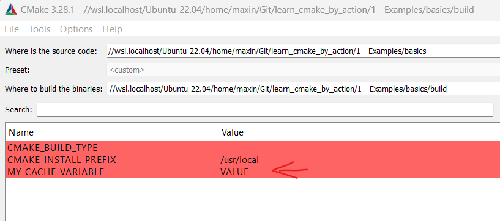

## How to run CMake
```CMake
# -S path to the root directory of CMake project
# -B build directory
cmake -S . -B build
cmake --build build

cmake --build build --target install
cmake --install build

# Enable detailed tracing of CMake (verbose...)
cmake -S . -B build --trace

# Only output the tracing log associated with the specific filenameb, nkm
cmake -S . -B build --trace-source="filename"
```

## Given example
```bash
cmake_minimum_required(VERSION 3.8)

# Create a project with C++
project(Calculator LANGUAGES CXX)

# Create a static lib called caclib
add_library(calclib STATIC src/calclib.cpp include/calc/lib.hpp)
# All objects linking to the calclib must include files under include folder
target_include_directories(calclib PUBLIC include)
# Specify the compiler flags (feature)
target_compile_features(calclib PUBLIC cxx_std_11)

# Create the executable called calc (header file can be missing)
add_executable(calc apps/calc.cpp)

# Link the object to the static lib (what's the point???)
target_link_libraries(calc PUBLIC calclib)
```

## Variables
```CMake
set(MY_VARIABLE "value")
```
### CACHE variables
```CMake
# Cache variable
# Main difference between normal and cache variables
# CACHE ones turn up in the cmake config tool as setting you can set
# reference: https://stackoverflow.com/questions/36097090/what-does-cache-string-in-cmake-cmakelists-file-mean
# Values are not over-written when executing a CMake file
set(MY_CACHE_VARIABLE "VALUE" CACHE STRING "Description")
```


## Cache file
`CMakeCache.txt` contains all the user (default if no) settings